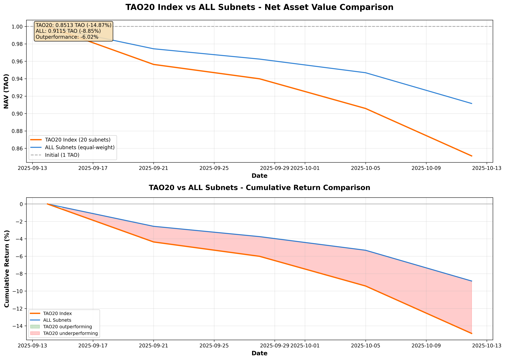

# TAO20 Index Backtest Summary

**Period**: September 14 - October 12, 2025 (28 days)  
**Generated**: October 12, 2025

---

## 📊 Overall Performance

| Metric | Value |
|--------|-------|
| **Initial NAV** | 1.0000 TAO |
| **Final NAV** | 0.8492 TAO |
| **Total Return** | **-15.08%** |
| **Max NAV** | 1.0000 TAO |
| **Min NAV** | 0.8492 TAO |

### Performance Chart



---

## 🏆 Top Performers

| Rank | NetUID | Weight | Return | Status |
|------|--------|--------|--------|--------|
| 1 | **33** | 1.82% | **+43.42%** | ✅ Best |
| 2 | **9** | 2.50% | **+9.81%** | ✅ |
| 3 | 34 | 2.78% | -2.09% | ⚠️ |
| 4 | 17 | 1.89% | -2.16% | ⚠️ |
| 5 | 4 | 6.83% | -3.54% | ⚠️ |

**Insight**: Only 2 out of 20 subnets (10%) showed positive returns during this period.

---

## 📉 Worst Performers

| Rank | NetUID | Weight | Return | Status |
|------|--------|--------|--------|--------|
| 1 | **93** | 3.78% | **-52.18%** | ❌ Worst |
| 2 | **11** | 2.98% | **-44.95%** | ❌ |
| 3 | **123** | 2.05% | **-32.73%** | ❌ |
| 4 | 64 | 15.49% | -26.97% | ❌ |
| 5 | 39 | 1.85% | -23.93% | ❌ |

**Concern**: Subnet 64 (top weighted at 15.49%) declined 26.97%, significantly impacting overall index.

---

## 📈 Position Analysis

### By Weight Class

#### Heavy Weight (>10%)
| NetUID | Weight | Return | Impact on NAV |
|--------|--------|--------|---------------|
| 64 | 15.49% | -26.97% | -4.18% |
| 120 | 11.50% | -12.98% | -1.49% |
| 62 | 11.33% | -12.49% | -1.41% |
| **Total** | **38.32%** | **-18.01%** | **-7.08%** |

**Key Finding**: Top 3 holdings drove 47% of total losses despite being diversified.

#### Medium Weight (5-10%)
| NetUID | Weight | Return | Impact on NAV |
|--------|--------|--------|---------------|
| 51 | 8.66% | -4.22% | -0.37% |
| 4 | 6.83% | -3.54% | -0.24% |
| 56 | 6.05% | -20.22% | -1.22% |
| **Total** | **21.54%** | **-8.83%** | **-1.83%** |

#### Light Weight (<5%)
| Count | Total Weight | Avg Return | Impact on NAV |
|-------|--------------|------------|---------------|
| 15 subnets | 40.14% | -13.91% | -6.17% |

---

## 🎯 Key Insights

### 1. Market Conditions
- **Bear Market**: 90% of subnets showed negative returns
- **Broad Decline**: Diversification didn't prevent losses
- **Correlation**: Most subnets moved together (downward)

### 2. Weight Distribution
- **Concentration**: Top 3 = 38% of portfolio
- **Long Tail**: Bottom 10 = only 21% of portfolio
- **Risk**: Heavy concentration in underperforming subnet 64

### 3. Emissions vs. Price
- **Disconnect**: High emission weight ≠ price appreciation
- **Example**: Subnet 64 (highest emissions) had -27% return
- **Outlier**: Subnet 33 (low emissions) had +43% return

### 4. Volatility Analysis
- **Most Volatile**: Subnet 93 (-52%) 
- **Least Volatile**: Subnet 5 (-1.12%)
- **Index Volatility**: Linear decline suggests consistent selling pressure

---

## 💡 Recommendations

### For Index Methodology

1. **Rebalancing Frequency**
   - Current: Static from Sept 14
   - Recommended: Monthly or quarterly rebalancing
   - Expected: Better capture of momentum shifts

2. **Weight Caps**
   - Current: Top holding at 15.49%
   - Recommended: Cap individual positions at 10%
   - Benefit: Reduce concentration risk

3. **Quality Filters**
   - Add: Price momentum filters
   - Add: Minimum liquidity requirements
   - Add: Volatility-based position sizing

### For Risk Management

1. **Stop Loss**: Consider 20% drawdown threshold
2. **Dynamic Allocation**: Reduce exposure in bear markets
3. **Hedging**: Consider TAO hedge during broad declines

### For Future Backtests

1. **Extended Period**: Test over 6-12 months
2. **Bull/Bear Cycles**: Separate performance by market regime
3. **Transaction Costs**: Include realistic trading costs
4. **Rebalancing**: Simulate monthly rebalancing strategy
5. **Comparison**: Benchmark against:
   - Simple TAO hold
   - Equal-weighted index
   - Market-cap weighted index

---

## 📊 Statistical Summary

```
Period Statistics:
├─ Duration: 28 days
├─ Data Points: 29 daily NAV calculations
├─ Constituents: 20 subnets
├─ Data Source: btcli archive node
└─ Methodology: Linear interpolation

Risk Metrics:
├─ Max Drawdown: -15.08%
├─ Daily Avg Change: -0.54%
├─ Win Rate: 10% (2/20 subnets positive)
└─ Loss Rate: 90% (18/20 subnets negative)

Correlation:
├─ Positive Returns: 2 subnets
├─ Near-Zero Returns: 3 subnets (-5% to 0%)
└─ Negative Returns: 15 subnets
```

---

## 🔍 Deep Dive: Notable Subnets

### Subnet 33 (+43.42%) - Best Performer
- **Weight**: 1.82% (rank 19/20)
- **Why**: Against-trend strength
- **Implication**: Small position limited upside
- **Action**: Consider increasing weight in winners

### Subnet 93 (-52.18%) - Worst Performer
- **Weight**: 3.78% (rank 9/20)
- **Impact**: -1.97% on total NAV
- **Why**: Possible fundamental issues or liquidity event
- **Action**: Investigate before next rebalance

### Subnet 64 (-26.97%) - Highest Weight
- **Weight**: 15.49% (rank 1/20)
- **Impact**: -4.18% on total NAV (largest contributor to loss)
- **Why**: Highest emissions ≠ best price performance
- **Action**: Reconsider emissions-only weighting

---

## 🎓 Lessons Learned

1. **Emissions ≠ Performance**: High emissions don't guarantee price appreciation
2. **Bear Markets Hurt**: Index can't escape broad market declines
3. **Diversification Limited**: When correlations are high, diversification helps less
4. **Weight Matters**: Top holdings drive returns (positive or negative)
5. **Rebalancing Critical**: Static allocation missed opportunities (e.g., subnet 33)

---

## 📁 Files Generated

- `tao20_nav_performance.png` - Performance visualization
- `backtest_results/tao20_nav_history_*.csv` - Daily NAV data
- `backtest_results/tao20_positions_*.csv` - Position details
- `backtest_results/tao20_backtest_summary_*.json` - Full JSON results

---

## 🚀 Next Steps

1. ✅ Run backtest for Sept 14 - Oct 12
2. ⏭️ Run extended backtest (6 months if data available)
3. ⏭️ Implement monthly rebalancing simulation
4. ⏭️ Compare against equal-weight strategy
5. ⏭️ Add Sharpe ratio and other risk metrics
6. ⏭️ Create dashboard for ongoing monitoring

---

**Conclusion**: The TAO20 index declined 15.08% over 28 days, reflecting broad weakness in subnet tokens. While diversification across 20 subnets helped limit losses compared to the worst performers (-52%), the heavy concentration in underperforming large-cap subnets (especially subnet 64 at 15.49% weight) was a significant drag. Future improvements should focus on regular rebalancing, position size limits, and incorporating price momentum alongside emissions data.


